# PyBaMM Aging Bridge

PyBaMM Aging Bridge is a mechanism-to-observable modeling project for lithium-ion battery aging diagnostics.

The project investigates how DFN-level electrochemical perturbations manifest as ECM-level diagnostic observables, including:

- short-window internal resistance `Ri`
- CDEFG-style HPPC voltage points
- relaxation time descriptors `tau1 / tau2`
- voltage recovery morphology
- contact overpotential
- SOC-dependent diagnostic fingerprints

The core objective is to establish a traceable bridge:

    DFN-level physical perturbation
    -> simulated HPPC response
    -> CDEFG / Ri / relaxation extraction
    -> ECM-level observable fingerprint
    -> aging diagnostic interpretation

---

## Motivation

Battery aging is not directly observable in practical systems. In most engineering workflows, degradation has to be inferred from measurable signals such as voltage response, pulse resistance, relaxation behavior, capacity, or energy efficiency.

A key risk is that different physical mechanisms can produce superficially similar observables. For example, an increase in short-window resistance may originate from charge-transfer degradation, contact resistance growth, temperature effects, or other coupled mechanisms.

This project therefore asks:

    Which electrochemical perturbation produces which observable diagnostic fingerprint?

The project does not start from an assumed SOH value. Instead, it perturbs interpretable DFN-level physical pathways and audits how they appear in observable HPPC-derived descriptors.

---

## Methodological Principle

This repository follows an audit-first modeling workflow.

Each notebook defines:

- its objective
- its workflow
- its expected outputs
- its interpretation boundary
- a final closure summarizing what was and was not established

The central rule is:

    Parameter perturbation is not itself a conclusion.
    Only observable drift under a controlled extraction protocol can support an interpretation.

---

## Model and Protocol

Current baseline:

- Model: PyBaMM DFN
- Parameter set: Chen2020
- Thermal setting: default isothermal
- Default temperature: 25 °C
- HPPC pulse: 1C discharge pulse for 10 s
- Relaxation: 600 s
- Main SOC points: 10%, 30%, 50%, 70%, 90%

PyBaMM current convention is explicitly tracked:

    PyBaMM convention:
    +I = discharge
    -I = charge

---

## Observable Extraction

The project uses a CDEFG-style HPPC extraction workflow.

For each pulse:

| Point | Meaning |
|---|---|
| C | pre-pulse baseline voltage |
| D | short-time voltage response after pulse start |
| E | end-of-pulse voltage |
| F | short-time recovery after current interruption |
| G | long-time recovered voltage |

Extracted observables include:

- `Ri_CD`
- `Ri_EF`
- `tau1 / tau2` from biexponential relaxation fitting
- 60 s and 300 s fitting-window tau descriptors
- relaxation residuals
- contact overpotential
- normalized remaining polarization

Important methodological note:

    tau1 / tau2 are observation-window-dependent descriptors,
    not unique physical constants.

---

## Perturbation Families

The current project focuses on four controlled perturbation families.

| Family | DFN-level perturbation | Intended physical meaning |
|---|---|---|
| `Ds_p` | positive particle diffusivity decrease | positive solid diffusion limitation |
| `j0_n` | negative exchange-current density decrease | negative-electrode charge-transfer degradation |
| `j0_p` | positive exchange-current density decrease | positive-electrode kinetic degradation |
| `contact_R` | contact resistance increase | pure ohmic / external contact resistance |

---

## Key Results

### 1. Corrected Tier-0 Fingerprints

After enabling the PyBaMM model option:

    {"contact resistance": "true"}

the corrected Tier-0 scan showed distinct fingerprints:

| Perturbation | Main response | Interpretation |
|---|---|---|
| `Ds_p ×0.5` | `tau2` increases, `Ri` nearly unchanged | diffusion-sensitive relaxation fingerprint |
| `j0_n ×0.5` | `Ri` increases strongly, `tau2` nearly unchanged | negative-electrode kinetic fingerprint |
| `j0_p ×0.5` | `Ri` increases moderately, `tau2` nearly unchanged | positive-electrode kinetic fingerprint |
| `contact_R = 5 mΩ` | `Ri` increases by exactly 5 mΩ, tau unchanged | pure ohmic/contact fingerprint |

---

### 2. Perturbation-Level Scan at SOC = 50%

At SOC = 50%, perturbation strength mapped monotonically into observable drift.

Key findings:

- decreasing `D_s,p` monotonically increased `tau2`
- decreasing `j0,n` monotonically increased `Ri`
- decreasing `j0,p` also increased `Ri`, but more weakly than `j0,n`
- increasing contact resistance produced a strictly linear ohmic response

This established that the selected fingerprints are not isolated one-point artifacts.

---

## Representative Figures

### Corrected Tier-0 mechanism fingerprint summary

This figure summarizes how different DFN-level perturbations project into ECM-level observables.

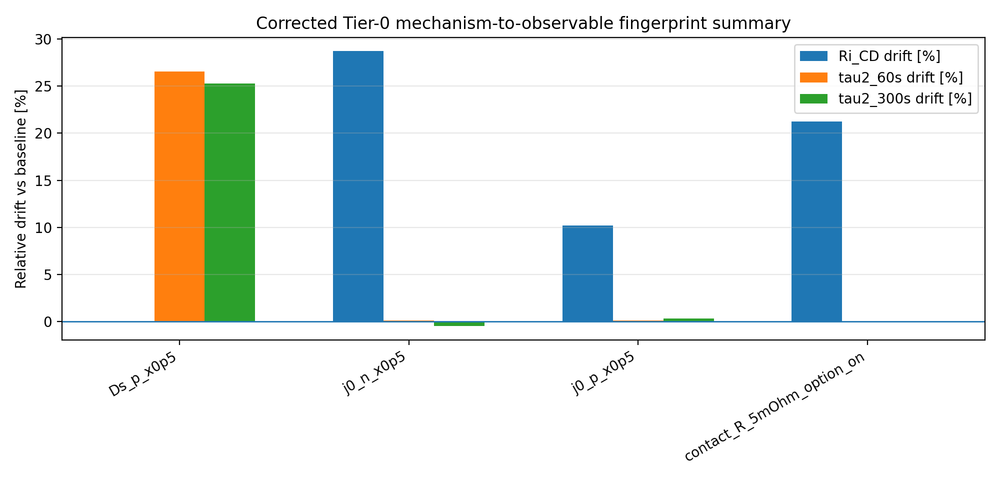

---

### SOC-resolved Ri-sensitive fingerprints

This figure shows how Ri-sensitive perturbations behave across SOC. The contact-resistance fingerprint remains SOC-invariant, while exchange-current perturbations remain sign-stable with mechanism-specific magnitude.

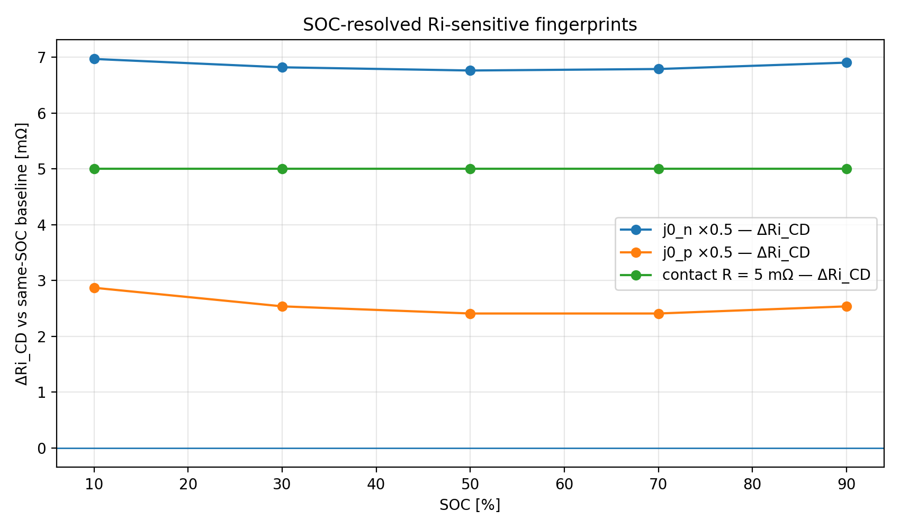

---

### SOC-resolved diffusion-sensitive tau2 fingerprint

This figure shows that positive solid diffusivity reduction produces a tau2 increase across all SOC points, but the magnitude is state-dependent.

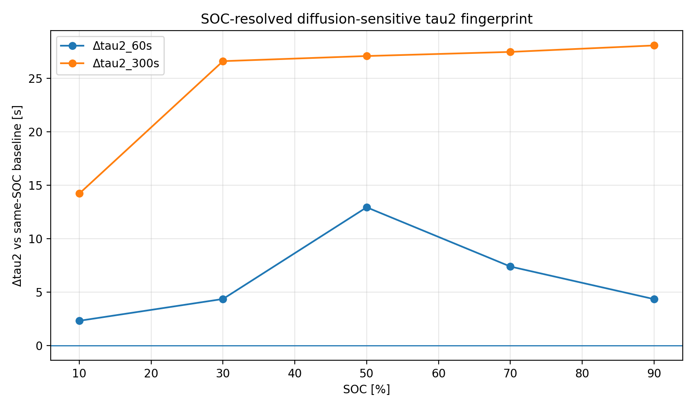

---

### 3. Temperature Entry Audit

The Chen2020 parameter set uses:

    Reference temperature = 298.15 K
    Ambient temperature   = 298.15 K
    Initial temperature   = 298.15 K

The default model is:

    thermal = isothermal
    surface temperature = ambient

Temperature-sensitive callable parameters include:

- negative electrode exchange-current density
- positive electrode exchange-current density
- electrolyte diffusivity
- electrolyte conductivity

A small 10 / 25 / 45 °C audit showed:

- `Ri` changes strongly with temperature
- `tau2` descriptors remain nearly unchanged under the current configuration

This means temperature must be treated as an independent operating-condition layer in future work.

---

### 3b. Temperature-Representative Fingerprint Check

A representative scan at SOC = 50% tested whether mechanism fingerprints remain identifiable across:

- 10 °C
- 25 °C
- 45 °C

Main findings:

- `Ds_p ×0.5` remains identifiable through `tau2` increase across all tested temperatures.
- `j0_n ×0.5` remains identifiable through Ri increase with mild magnitude variation.
- `j0_p ×0.5` remains identifiable but weakens at higher temperature.
- `contact_R = 5 mΩ` remains temperature-invariant, producing exactly +5 mΩ Ri shift and 25 mV contact overpotential.

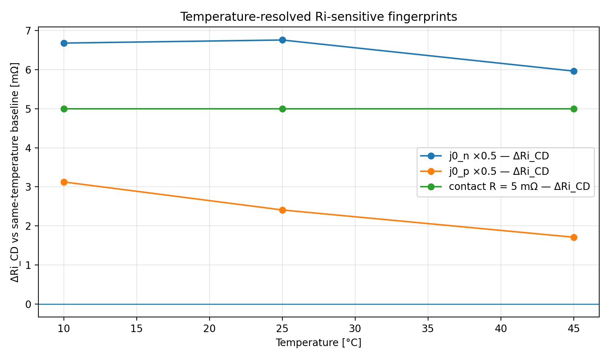

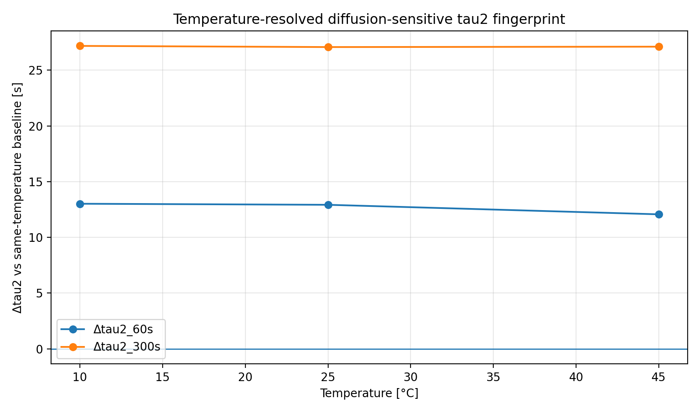

---

### 4. Multi-SOC Fingerprint Stability

A multi-SOC scan across 10%, 30%, 50%, 70%, and 90% SOC showed that fingerprint stability has two levels:

    sign stability:
    whether the observable changes in the same direction across SOC

    magnitude stability:
    whether the size of the change remains similar across SOC

Summary:

| Fingerprint family | SOC behavior |
|---|---|
| baseline | Ri and tau2 are SOC-dependent |
| `Ds_p ×0.5` | sign-stable, magnitude state-dependent |
| `j0_n ×0.5` | sign-stable, magnitude relatively stable |
| `j0_p ×0.5` | sign-stable, weaker but stable |
| `contact_R = 5 mΩ` | SOC-invariant |

This supports the interpretation that mechanism fingerprints are not simply present or absent. Their direction and magnitude must be evaluated separately.

---

## Interpretation Rules

Current diagnostic interpretation rules:

| Observable pattern | Supported interpretation |
|---|---|
| `Ri ↑`, `tau2 ≈ constant` | kinetic / charge-transfer or ohmic pathway |
| `tau2 ↑`, `Ri ≈ constant` | diffusion-sensitive relaxation limitation |
| constant `Ri` offset across SOC with `I·R` consistency | contact resistance pathway |
| baseline `Ri` or `tau` changes with SOC | same-SOC baseline comparison is mandatory |
| `Ri` changes strongly with temperature | temperature effect must be separated from degradation mechanisms |

---

## SEI-only Metric Registry v0.1

Notebook 15 extends the SEI-only aging fingerprint analysis into a broader diagnostic metric registry.

The goal is to move beyond a narrow `Ri / tau1 / tau2` audit and classify SEI-only aging using multiple observable layers.

### Implemented metric layers

| Layer | Status | Main metrics |
|---|---|---|
| degradation state | active | SEI thickness, LLI, lithium lost, side-reaction capacity loss |
| external capacity RPT | active | RPT discharge capacity, capacity retention, capacity fade |
| multi-window resistance | active | Ri_0.1s, Ri_1s, Ri_10s, recovery Ri |
| fitted relaxation | active | tau1_60s, tau1_300s, tau2_60s, tau2_300s |
| non-parametric relaxation | active | tau_FG_eff, t95, t99, tau_tail, recovery area |
| voltage recovery / pseudo-OCV | feasibility | finite-rest Uinf and recovery amplitude |
| OCV / ICA / DVA | deferred | requires low-rate or quasi-equilibrium voltage curve |
| thermal | deferred | requires non-isothermal model branch |

### Main SEI-only classification

Using Metric Registry v0.1, the SEI-only fingerprint is classified as:

    capacity / LLI dominant mixed signature

The dominant layer is the capacity / LLI degradation-state layer.

The secondary layer is a weak but monotonic multi-window Ri component.

The fitted and non-parametric relaxation descriptors are useful audit layers, but they do not form the dominant SEI-only fingerprint under the present proof-of-concept protocol.

### Representative SEI Metric Registry figures

External capacity RPT:

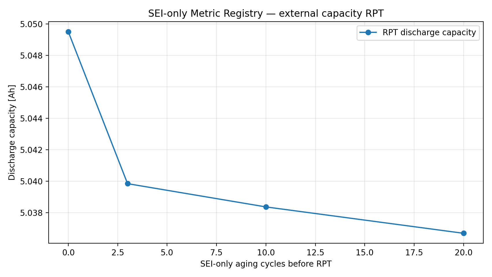

Capacity retention:

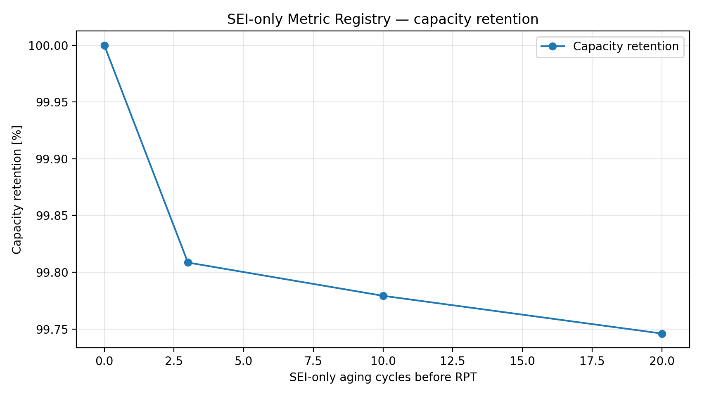

LLI and side-reaction capacity loss:

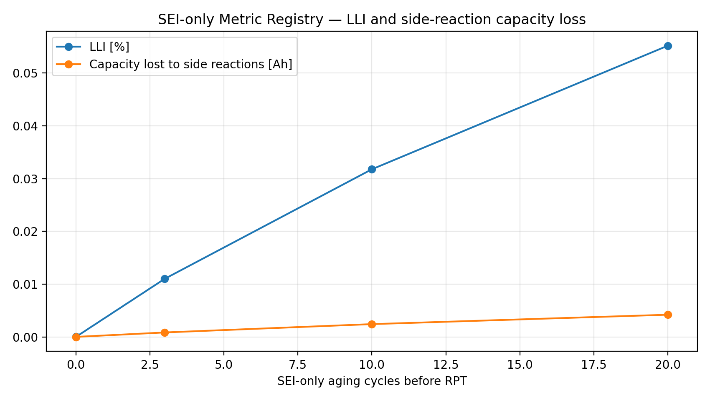

Multi-window resistance drift:

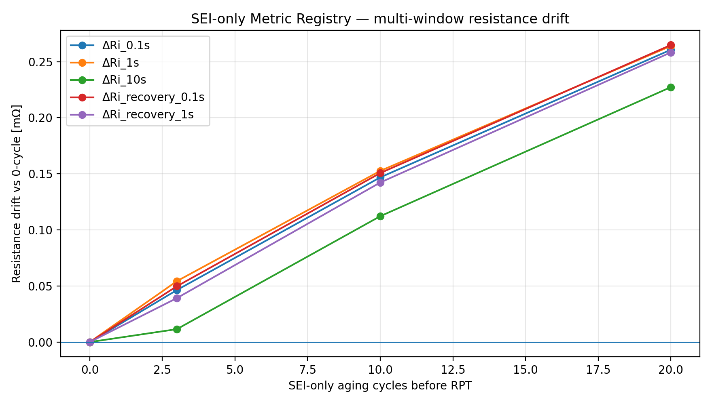

Fitted tau descriptor drift:

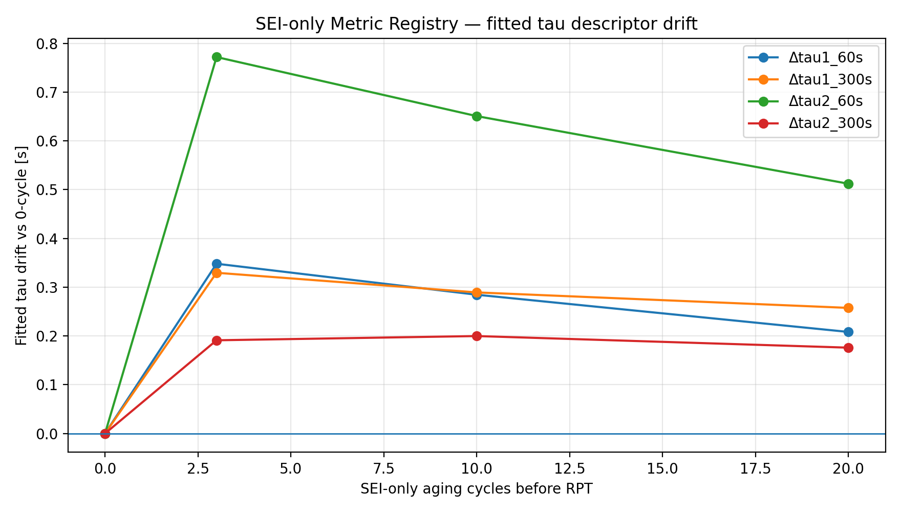

Non-parametric relaxation descriptor drift:

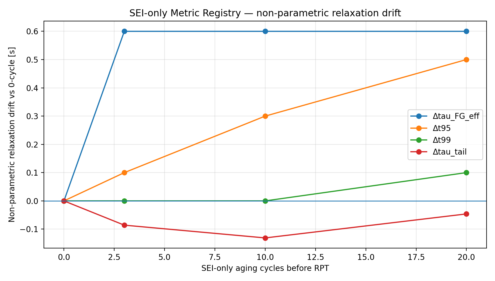

### Methodological boundary

The capacity RPT and HPPC/RPT branches are diagnostic only.

They are not used as starting points for subsequent aging.

The RPT conditioning is nominal-capacity based and approximate.

Voltage-recovery metrics are finite-rest recovery descriptors, not strict OCV-SOC measurements.

Thermal metrics remain deferred under the current isothermal model configuration.

## Notebook Index

| Notebook | Purpose |
|---|---|
| `01_baseline_chen2020_c3_smoke.ipynb` | baseline C/3 DFN smoke test |
| `02_baseline_hppc_one_soc_smoke.ipynb` | one-SOC HPPC extraction chain |
| `03_tier0_mechanism_sanity_scan.ipynb` | initial Tier-0 perturbation sanity scan |
| `04_tier0_contact_resistance_audit.ipynb` | contact-resistance option audit |
| `05_corrected_tier0_fingerprint_scan.ipynb` | corrected Tier-0 fingerprint scan |
| `06_phaseB_level_scan_soc50.ipynb` | SOC=50% perturbation-level scan |
| `07_temperature_model_audit.ipynb` | temperature entry-point audit |
| `08_multi_soc_fingerprint_scan.ipynb` | multi-SOC fingerprint stability scan |
| `09_fingerprint_map_summary.ipynb` | consolidated fingerprint map and interpretation rules |

---

## Current Scope Boundary

This repository does not yet claim:

- full aging simulation
- SOH trajectory prediction
- validated SEI or plating aging behavior
- transferability across chemistries
- thermal-aging coupling
- experimental validation of the simulated fingerprints

Current conclusions are bounded by:

- Chen2020 DFN for controlled perturbation fingerprint mapping,
- OKane2022 DFN for degradation-enabled SEI-only aging branches,
- selected perturbation families
- HPPC-style 1C 10 s discharge pulse
- 600 s relaxation
- default isothermal 25 °C condition unless explicitly varied
- selected SOC points

---

## Next Steps

Planned next stages:

1. Add representative figures to README.
2. Extend fingerprint checks to selected temperature-mechanism interactions.
3. Add controlled aging mechanism branches:
   - SEI-only
   - plating-stress isolation
4. Later: compare simulated fingerprints with experimental HPPC aging observables.

---

## Project Status

Current status:

    Phase A: infrastructure and HPPC observable extraction — complete
    Phase B-0: corrected Tier-0 fingerprints — complete
    Phase B-1: SOC=50% perturbation-level scan — complete
    Phase B-2: temperature entry audit — complete
    Phase B-3: multi-SOC fingerprint stability scan — complete
    Phase B-4: fingerprint map summary — complete
    Next: repository presentation cleanup and representative figures

## Fixed-endpoint pseudo-OCV audit

Notebook 16 adds a fixed-endpoint pseudo-OCV feasibility audit for the SEI-only aging branch. The protocol uses full-charge preconditioning, followed by a C/3 discharge to the same loaded terminal-voltage endpoint, `Ukl = 3.70 V`, and a fixed 60 min rest.

The audit shows that the fixed-endpoint protocol is technically clean: the loaded-voltage endpoint error is negligible and the rest-duration quality check passes. Under SEI-only aging, the same loaded terminal-voltage endpoint is reached after less discharged capacity. From 0 to 20 cycles, `Q_to_Ukl` decreases by approximately `0.01068 Ah`, while the nominal endpoint SOC shifts upward by approximately `0.214 percentage points`.

The finite-rest voltage descriptor remains weak. `U00_after_fixed_rest` shifts by approximately `+0.407 mV`, while the recovery amplitude remains essentially neutral. Therefore, the fixed-endpoint pseudo-OCV layer is classified as a feasibility-level auxiliary diagnostic layer, not as a strict OCV-SOC or ICA/DVA diagnostic.

Representative outputs:

- `docs/figures/fixed_endpoint_pseudo_ocv_Q_to_Ukl_drift.png`
- `docs/figures/fixed_endpoint_pseudo_ocv_endpoint_soc_drift.png`
- `docs/figures/fixed_endpoint_pseudo_ocv_U00_after_rest_drift_mV.png`
- `docs/figures/fixed_endpoint_pseudo_ocv_recovery_features.png`
- `docs/tables/fixed_endpoint_pseudo_ocv_quality_audit.csv`
- `docs/tables/fixed_endpoint_pseudo_ocv_drift_table.csv`
- `docs/tables/fixed_endpoint_pseudo_ocv_classification_table_clean.csv`
- `docs/tables/fixed_endpoint_pseudo_ocv_metric_table.csv`

## Strict OCV / ICA / DVA feasibility audit

Notebook 17 adds a dedicated low-rate OCV-like diagnostic branch for the SEI-only aging workflow. The protocol starts from the pre-diagnostic full-charge-rest checkpoint state generated by the aging protocol and then performs a C/25 discharge to 2.5 V followed by a 60 min rest.

A selected-segment audit is required because PyBaMM `starting_solution` carries the preceding aging history into the diagnostic solution. The final diagnostic discharge segment is therefore selected explicitly as the last discharge segment with `0.15 A <= I_mean <= 0.25 A` and duration greater than 1000 min.

The selected C/25 diagnostic segments pass the audit across all checkpoints. The low-rate discharge capacity decreases from `5.100624 Ah` at 0 cycles to `5.085432 Ah` at 20 cycles, corresponding to approximately `0.2978 %` capacity fade.

The start-state audit passes with a C/25 diagnostic start-voltage spread of approximately `5.407 mV`, below the 10 mV feasibility threshold. This supports feasibility-level OCV-like analysis, while early-Q derivative interpretation remains conservative.

The V(Q) quality audit passes for all checkpoints. ICA and DVA derivative features are technically extractable from the smoothed low-rate V(Q) curves. The dominant ICA peak appears around `Q ≈ 0.48–0.49 Ah`, while DVA shows stronger endpoint sensitivity near the low-voltage cutoff.

This branch is classified as a feasibility-level strict OCV / ICA / DVA audit. It does not yet prove strict thermodynamic OCV or mechanism-unique ICA/DVA fingerprints.

Representative outputs:

- `docs/figures/strict_ocv_like_VQ_overlay.png`
- `docs/figures/strict_ocv_like_deltaV_vs_Q.png`
- `docs/figures/strict_ocv_ica_overlay.png`
- `docs/figures/strict_ocv_dva_overlay.png`
- `docs/tables/strict_ocv_ica_dva_quality_audit.csv`
- `docs/tables/strict_ocv_ica_dva_curve_summary.csv`
- `docs/tables/strict_ocv_ica_dva_start_state_audit.csv`
- `docs/tables/strict_ocv_ica_dva_feature_table.csv`
- `docs/tables/strict_ocv_ica_dva_classification_table.csv`
- `docs/tables/strict_ocv_ica_dva_output_inventory.csv`

## Slow-rate OCV-like validation audit

Notebook 18 audits whether the C/25 OCV-like voltage-curve descriptors from Notebook 17 remain structurally stable when the diagnostic discharge rate is reduced to C/50.

The audit compares two SEI-only aging checkpoints, 0 cycles and 20 cycles, under two diagnostic rates: C/25 and C/50. The selected diagnostic segments pass the rate-specific audit. C/25 branches show mean current ≈ 0.2 A and duration ≈ 1525–1530 min, while C/50 branches show mean current ≈ 0.1 A and duration ≈ 3053–3062 min.

All V(Q) curves pass the quality audit. C/50 produces a systematic voltage elevation relative to C/25, consistent with lower polarization at lower diagnostic current. The mean C50–C25 voltage offset is approximately +6.1 to +6.2 mV, with p95 absolute difference ≈ 8.51 mV and endpoint-sensitive maximum differences of approximately 14–16 mV.

ICA and DVA features are extractable at both diagnostic rates. ICA peak position shows rate sensitivity, with C50–C25 peak-Q shifts of approximately +0.0463 Ah at 0 cycles and −0.0168 Ah at 20 cycles. DVA median magnitude remains highly stable, with relative changes below 0.3%.

Project-level classification:

`C/25 OCV-like diagnostic branch = partially supported`

C/25 remains adequate for practical OCV-like feasibility analysis, but derivative-level interpretation remains protocol-sensitive. The result supports C/25 as an engineering-practical diagnostic branch, but not as strict thermodynamic OCV.

Representative outputs:

- `docs/figures/slow_rate_ocv_validation_VQ_overlay.png`
- `docs/figures/slow_rate_ocv_validation_deltaV_rate_effect.png`
- `docs/figures/slow_rate_ocv_validation_ica_overlay.png`
- `docs/figures/slow_rate_ocv_validation_dva_overlay.png`
- `docs/tables/slow_rate_ocv_validation_selected_segment_audit.csv`
- `docs/tables/slow_rate_ocv_validation_curve_summary.csv`
- `docs/tables/slow_rate_ocv_validation_quality_audit.csv`
- `docs/tables/slow_rate_ocv_validation_rate_effect_audit.csv`
- `docs/tables/slow_rate_ocv_validation_feature_table.csv`
- `docs/tables/slow_rate_ocv_validation_feature_rate_audit.csv`
- `docs/tables/slow_rate_ocv_validation_classification_table.csv`
- `docs/tables/slow_rate_ocv_validation_output_inventory.csv`

## GITT-like finite-rest OCV reconstruction audit

Notebook 19 audits whether a coarse GITT-like pulse-rest diagnostic protocol can reconstruct finite-rest OCV-like voltage points from the SEI-only aging branch.

The protocol uses repeated C/10 discharge pulses followed by 60 min rest periods. Each diagnostic branch contains 16 pulse-rest pairs. Each pulse discharges approximately 0.25 Ah, producing a reconstructed finite-rest OCV-like curve over a cumulative discharge window of approximately 4.0 Ah.

The selected pulse-rest sequences pass the segment-level audit at both 0-cycle and 20-cycle checkpoints:

- mean pulse current ≈ 0.5 A,
- pulse duration = 30 min,
- rest duration = 60 min,
- cumulative reconstructed Q-window ≈ 4.0 Ah.

The finite-rest reconstruction quality audit passes. Rest-end voltage points are smooth and monotonic with cumulative discharged capacity. Pulse charge is highly consistent, and rest recovery amplitude remains positive for all pulse-rest pairs.

The 20-cycle curve is slightly lower than the 0-cycle reference over the reconstructed Q-window:

- mean ΔU(20 cycles − 0 cycles) ≈ −1.974 mV,
- median ΔU ≈ −2.054 mV,
- maximum absolute voltage drift ≈ 3.026 mV.

Rest-recovery amplitude changes are very weak, with mean Δrecovery ≈ −0.115 mV and maximum absolute recovery shift ≈ 0.630 mV.

Project-level classification:

`GITT-like finite-rest OCV reconstruction = feasibility supported`

The protocol can reconstruct smooth and monotonic finite-rest OCV-like points in the SEI-only aging branch. It provides a weak voltage-drift descriptor, but strict thermodynamic OCV remains unproven.

Representative outputs:

- `docs/figures/gitt_like_ocv_reconstruction_overlay.png`
- `docs/figures/gitt_like_ocv_deltaU_vs_Q.png`
- `docs/figures/gitt_like_ocv_recovery_amplitude.png`
- `docs/tables/gitt_like_ocv_segment_audit.csv`
- `docs/tables/gitt_like_ocv_selected_sequence_audit.csv`
- `docs/tables/gitt_like_ocv_reconstruction_point_table.csv`
- `docs/tables/gitt_like_ocv_quality_audit.csv`
- `docs/tables/gitt_like_ocv_0_vs_20_comparison_table.csv`
- `docs/tables/gitt_like_ocv_classification_table.csv`
- `docs/tables/gitt_like_ocv_output_inventory.csv`

## Stronger SEI-only aging checkpoint audit

Notebook 20 extends the SEI-only aging branch from 20 cycles to stronger checkpoints at 50 and 100 cycles.

The degradation mechanism is unchanged: OKane2022 with solvent-diffusion-limited SEI only, with plating, LAM, particle mechanics, SEI porosity change, and thermal coupling disabled.

The audit confirms that all available degradation-state metrics increase monotonically from 0 to 100 cycles:

- SEI thickness increases from approximately 5.01 nm to 18.66 nm.
- LLI increases from approximately 0.00009% to 0.1687%.
- total lithium lost increases from approximately 2.65e-7 mol to 4.79e-4 mol.
- SEI capacity loss increases from approximately 0.000007 Ah to 0.01284 Ah.

Relative to the 20-cycle checkpoint, the 100-cycle checkpoint amplifies all available degradation-state metrics by approximately 3.06×.

Project-level classification:

`50/100-cycle SEI-only aging checkpoints = supported`

The stronger checkpoints are suitable for downstream diagnostic audits. However, this notebook does not yet establish a mechanism-unique SEI diagnostic fingerprint; it only confirms monotonic and amplified SEI-only aging severity.

Representative outputs:

- `docs/figures/stronger_sei_aging_degradation_state.png`
- `docs/figures/stronger_sei_aging_capacity_loss.png`
- `docs/tables/stronger_sei_aging_state_table.csv`
- `docs/tables/stronger_sei_aging_monotonicity_audit.csv`
- `docs/tables/stronger_sei_aging_classification_table.csv`

