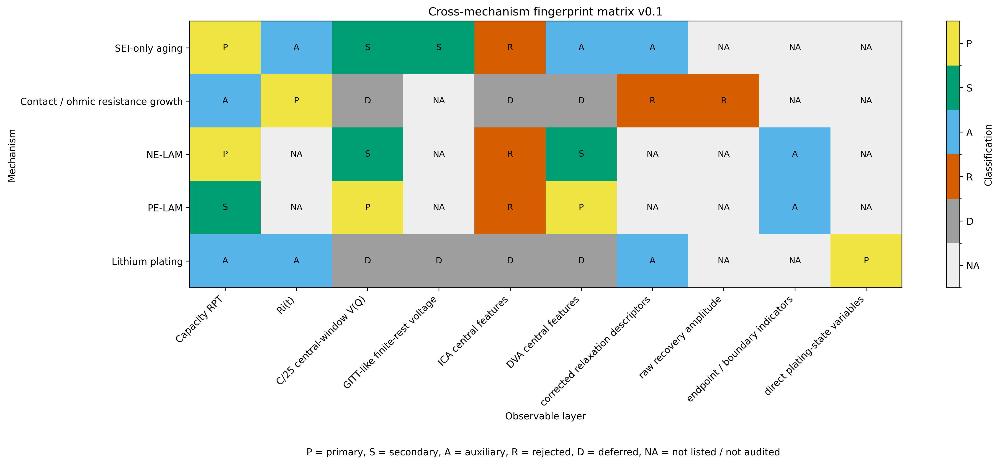

# PyBaMM Aging Bridge

> PyBaMM-based workflows for linking lithium-ion battery aging mechanisms
> to measurable diagnostic features and validation-oriented test protocols.

This project asks one question:

> **Which measurable battery-test features provide reliable evidence for which aging mechanisms?**

The project does not start from an assumed SOH value. Instead, it perturbs
interpretable DFN-level physical pathways and evaluates how these mechanisms
appear in measurement-accessible diagnostic descriptors, including HPPC pulse
resistance, biexponential relaxation, low-rate pseudo-OCV, GITT-like
reconstruction, ICA/DVA, and capacity RPT.

---

## Current release snapshot v0.1

The v0.1 release consolidates five completed mechanism branches into a
cross-mechanism evidence map:

| Mechanism family | Classification | Primary target layer |
|---|---|---|
| SEI-only aging | Capacity-dominant, voltage-secondary, derivative-auxiliary | Capacity RPT |
| Contact / ohmic resistance growth | Ri(t)-dominant | Multi-window Ri(t) |
| Negative-electrode loss of active material | Capacity-dominant, boundary-sensitive | Capacity RPT |
| Positive-electrode loss of active material | Voltage-shape and DVA-dominant | C/25 central-window V(Q), DVA central features |
| Lithium plating | Model-internal plating-state variables observable; external diagnostic fingerprint deferred | Model-internal plating-state variables |

**Synthesis entry point:** [`notebooks/27_cross_mechanism_fingerprint_synthesis.ipynb`](notebooks/27_cross_mechanism_fingerprint_synthesis.ipynb)
→ [`docs/cross_mechanism_fingerprint_synthesis_v0_1.md`](docs/cross_mechanism_fingerprint_synthesis_v0_1.md)



*P = primary, S = secondary, A = auxiliary, R = rejected, D = deferred, NA = not audited.*

---

## Installation

Tested with PyBaMM 26.3.1 on macOS. Newer PyBaMM versions may differ in
parameter-set definitions or solver behavior; if you upgrade, re-run
notebooks `01` and `02` as smoke tests first.

```bash
git clone https://github.com/jiaxingLu/pybamm-aging-bridge.git
cd pybamm-aging-bridge
python -m venv .venv
source .venv/bin/activate
pip install -r requirements.txt
jupyter lab
```

The committed `requirements.txt` provides the minimal pinned dependency set
used for the current notebooks (PyBaMM 26.3.1 and matched scientific Python
versions). The `Chen2020`, `OKane2022`, and `ORegan2022` parameter sets are
built into PyBaMM — no extra download step is required.

---

## How to read this repository

| If you want to ... | Start here |
|---|---|
| See the v0.1 cross-mechanism conclusion | `notebooks/27_cross_mechanism_fingerprint_synthesis.ipynb` + `docs/cross_mechanism_fingerprint_synthesis_v0_1.md` |
| Understand baseline + Tier-0 fingerprints | Notebooks `01–10` |
| Read the SEI-only aging branch | Notebooks `11–15`, then `20–22` for stronger checkpoints |
| Read the low-rate OCV / ICA / DVA feasibility chain | Notebooks `16–19` |
| Read the contact / ohmic resistance branch | Notebook `23` |
| Read the LAM branch (NE-LAM + PE-LAM) | Notebook `24` |
| Read the lithium plating branch | Notebooks `25`, `26`, `26B` |

---

## Core conventions

These conventions are global to all notebooks in this repository.

**PyBaMM current sign:** `+I = discharge`, `−I = charge`.

**HPPC sampling points (internal naming):**

| Point | Meaning |
|---|---|
| C | pre-pulse baseline voltage |
| D | short-time voltage response after pulse start |
| E | end-of-pulse voltage |
| F | short-time recovery after current interruption |
| G | long-time recovered voltage |

The CDEFG labels are an internal convention for this project — they do not
correspond to IEC 62660 or USABC nomenclature.

**Relaxation descriptors:** `tau1`, `tau2` are obtained by biexponential fitting
over a finite observation window. They are window-dependent descriptors,
not unique physical time constants.

**Default baseline configuration:**

| | |
|---|---|
| Model | PyBaMM DFN with Chen2020 for controlled perturbation; OKane2022 for degradation-enabled branches; ORegan2022 referenced for parameter cross-checks |
| Thermal | isothermal, 25 °C, unless explicitly varied |
| HPPC pulse | 1C discharge, 10 s, followed by 600 s relaxation |
| Standard SOC points | 10%, 30%, 50%, 70%, 90% |

---

## Methodological principle: audit-first

*Audit-first* means: every physical claim must be traceable to a visible
intermediate artifact (table, figure, or boundary check) inside the notebook
that produced it. No claim is allowed to rest on hidden state.

Each notebook declares its objective, workflow, expected outputs,
interpretation boundary, and a closing summary that states what was and
was not established. The central rule:

> Parameter perturbation is not itself a conclusion.
> Only observable drift under a controlled extraction protocol can support
> an interpretation.

---

## Aging-evidence and fitting-target rejection rules

A diagnostic feature is **not recommended as a primary aging-evidence or
fitting target** if any of the following hold:

1. **Signal-to-smoothing-range ratio < 1** — aging-induced change smaller than
   smoothing-window variability.
2. **Monotonic fraction across smoothing < 0.75** — monotonic aging trend not
   preserved across smoothing windows.
3. **Signal appears only in the endpoint region** — likely cutoff-boundary
   amplification, usable-capacity shift, or endpoint curvature artifact.
4. **Strong preprocessing dependence** — substantial change with smoothing,
   interpolation, common-Q grid choice, or endpoint truncation.
5. **Weak physical linkage to degradation-state variables** — not consistently
   linked to SEI thickness, LLI, lithium loss, or SEI capacity loss.
6. **Mechanism non-uniqueness** — plausibly producible by multiple mechanisms
   (SEI / plating / LAM / resistance growth).
7. **Signal magnitude below protocol sensitivity** — drift smaller than the
   sensitivity introduced by the diagnostic protocol itself.

Current applications:

- **Capacity RPT** — recommended primary fitting target for SEI-only aging.
- **GITT-like finite-rest voltage points** and **C/25 central-window V(Q)** —
  secondary voltage-shape constraints.
- **C/25 endpoint / full-window drift** — boundary diagnostic only, endpoint-amplified.
- **ICA / DVA derivative features under SEI-only aging** — auxiliary audit
  descriptors, not primary fitting targets.
- **DVA central features under PE-LAM** — currently supported as a primary
  candidate within the tested LAM branch.

---

## Notebook index

| Notebook | Phase | Core finding |
|---|---|---|
| `01_baseline_chen2020_c3_smoke` | A | DFN C/3 baseline smoke test |
| `02_baseline_hppc_one_soc_smoke` | A | one-SOC HPPC extraction chain |
| `03_tier0_mechanism_sanity_scan` | B-0 | initial Tier-0 sanity scan (superseded by 05) |
| `04_tier0_contact_resistance_audit` | B-0 | contact resistance model option audit |
| `05_corrected_tier0_fingerprint_scan` | B-0 | corrected Tier-0: Ds_p → tau2↑; j0_n/p → Ri↑; contact_R → linear Ri offset |
| `06_phaseB_level_scan_soc50` | B-1 | monotonic perturbation-strength → observable drift at SOC = 50% |
| `07_temperature_model_audit` | B-2 | temperature entry-point audit; Ri strongly T-sensitive, tau2 weakly |
| `08_multi_soc_fingerprint_scan` | B-3 | sign-stable vs magnitude-stable separation across 10–90% SOC |
| `09_fingerprint_map_summary` | B-4 | consolidated fingerprint map and interpretation rules |
| `10_temperature_representative_fingerprint_check` | B-2′ | mechanism fingerprints remain identifiable at 10/25/45 °C |
| `11_sei_only_entry_audit` | C-SEI | OKane2022 SEI-only branch entry audit |
| `12_sei_only_cycling_rpt_fingerprint` | C-SEI | SEI-only cycling + RPT fingerprint |
| `13_sei_only_aged_state_rpt_design` | C-SEI | aged-state RPT diagnostic design |
| `14_sei_only_multi_checkpoint_rpt_fingerprint` | C-SEI | multi-checkpoint SEI RPT fingerprint |
| `15_sei_only_capacity_rpt_extension` | C-SEI | Metric Registry v0.1: capacity / LLI dominant mixed signature |
| `16_fixed_endpoint_pseudo_ocv_audit` | D-OCV | fixed-endpoint pseudo-OCV: feasibility-level auxiliary diagnostic |
| `17_strict_ocv_ica_dva_feasibility_audit` | D-OCV | C/25 OCV-like V(Q) feasibility supported; ICA/DVA extractable |
| `18_slow_rate_ocv_validation_audit` | D-OCV | C/25 vs C/50: partially supported, derivative features rate-sensitive |
| `19_gitt_like_ocv_reconstruction_feasibility_audit` | D-OCV | GITT-like finite-rest reconstruction: feasibility supported, drift weak |
| `20_stronger_sei_aging_checkpoint_audit` | C-SEI+ | 50/100-cycle SEI checkpoints supported; ~3× amplification at 100 cycles |
| `21_stronger_sei_diagnostic_branch_audit` | C-SEI+ | SEI 100-cycle: capacity-dominant (~0.47% fade), voltage descriptors secondary |
| `22_derivative_feature_identifiability_under_stronger_sei` | C-SEI+ | ICA/DVA derivative features not primary under SEI-only aging |
| `23_resistance_growth_fingerprint_audit` | C-Ri | contact_R recovered as additive Ri shift (max error ≈ 1e-10 mΩ); Ri(t)-dominant |
| `24_LAM_fingerprint_audit` | C-LAM | NE-LAM: capacity-dominant + boundary-sensitive; PE-LAM: voltage-shape / DVA-dominant |
| `25_plating_entry_observability_audit` | C-Plating | plating entry observability supported; full fingerprint deferred |
| `26_plating_full_fingerprint_audit` | C-Plating | Phase A only — HPPC Phase B killed Jupyter kernel (in-notebook execution boundary) |
| `26B_plating_hppc_process_isolated_audit` | C-Plating | HPPC layer process-isolated; matched Ri(t) shift weak (max ≈ 0.12 mΩ) |
| `27_cross_mechanism_fingerprint_synthesis` | E | v0.1 cross-mechanism synthesis (current release entry point) |

Notebook `26B` complements `26`: the HPPC layer that caused kernel death
under in-notebook DFN + SEI-background plating + `starting_solution` + dense
HPPC sampling was moved into isolated external Python processes via
`scripts/run_plating_hppc_condition.py`.

---

## Interpretation boundaries

This repository is a research audit repository, not a production battery
diagnostics system.

Current boundaries:

- Results are based primarily on DFN-based PyBaMM 26.3.1 workflows and the
  parameter sets specified per notebook. Generalization to other cell
  chemistries, formats, or operating envelopes is not claimed.
- A changing observable is not automatically a valid fitting target.
- Capacity fade, voltage-shape drift, resistance increase, and derivative
  features can each be mechanism-non-unique.
- Lithium plating direct variables are model-internal observables. They are
  not equivalent to closed measurement-accessible fitting targets.
- External lithium-plating diagnostic closure remains deferred until future
  process-isolated diagnostic audits are completed.
- Derivative features (ICA / DVA) require smoothing and endpoint-sensitivity
  controls before interpretation.
- This repository does not yet claim: full aging-trajectory prediction,
  validated cross-chemistry transfer, thermal-aging coupling, or experimental
  validation of simulated fingerprints.

---

## Repository structure

```
notebooks/   audit notebooks (01–27)
scripts/     process-isolated execution scripts (e.g. plating HPPC)
docs/        release-grade summaries, tables, figures, and per-notebook audits
data/        local traceability outputs (not under version control by default)
figures/     local traceability figures (not under version control by default)
```

**Artifact convention:** `docs/tables/` and `docs/figures/` are
documentation-ready outputs intended for repository display. Root-level
`data/` and `figures/` are local-only traceability outputs.

---

## Project status

| Phase | Scope | Status |
|---|---|---|
| A | infrastructure and HPPC observable extraction | complete |
| B | corrected Tier-0 / SOC scan / temperature / multi-SOC | complete |
| C | mechanism branches (SEI, Ri, LAM, plating) | complete; plating external diagnostic deferred |
| D | OCV / ICA / DVA feasibility (C/25, slow-rate, GITT-like) | feasibility-level support; derivative features auxiliary |
| E | v0.1 cross-mechanism synthesis | released |

**Next:** targeted lithium-plating external diagnostic closure. Priority
layers in order: C/25 central-window V(Q) → GITT-like finite-rest voltage →
ICA central features → DVA central features. Broad simulation sweeps are not
recommended before these deferred layers are closed.

---

## License

MIT License — see [`LICENSE`](LICENSE).

Copyright (c) 2026 Jiaxing Lu.
